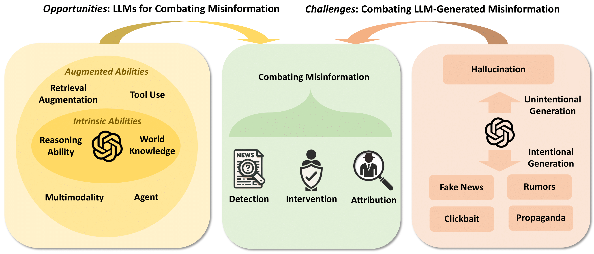

# llm-misinformation-survey

<div align=center></div>

>The repository for the survey **[Combating Misinformation in the Age of LLMs: Opportunities and Challenges](https://llm-misinformation.github.io/static/pdf/Combating%20Misinformation%20in%20the%20Age%20of%20LLMs:%20Opportunities%20and%20Challenges.pdf)** <br>[Canyu Chen](https://canyuchen.com), [Kai Shu](http://www.cs.iit.edu/~kshu/)<br>
>
>We will maintain this list of papers and related resources for the initiative "**[LLMs Meet Misinformation](https://llm-misinformation.github.io/)**", which aims to combat misinformation in the age of LLMs. We greatly appreciate any contributions via issues, PRs, emails or other methods if you have a paper or are aware of relevant research that should be incorporated.
>
> More resources on "**LLMs Meet Misinformation**" are on the website: https://llm-misinformation.github.io/
>
>Any suggestion, comment or related discussion is welcome. Please let us know by email (cchen151@hawk.iit.edu) or wechat (ID: alexccychen)

If you find our survey or paper list useful, we will greatly appreacite it if you could consider citing our paper:
```
@article{chencombating,
  title   = {Combating Misinformation in the Age of LLMs: Opportunities and Challenges},
  author  = {Canyu Chen and Kai Shu},
  year    = {2023},
  journal = {researchgate preprint}
}
```


## 🔔 News
- 🔥 [2023/10/26] We release the paper list and our survey paper [Combating Misinformation in the Age of LLMs: Opportunities and Challenges](https://llm-misinformation.github.io/static/pdf/Combating%20Misinformation%20in%20the%20Age%20of%20LLMs:%20Opportunities%20and%20Challenges.pdf).

- 🔥 [2023/10/18] We release the dataset and code for our paper [Can LLM-Generated Misinformation Be Detected?](https://llm-misinformation.github.io/static/pdf/Combating%20Misinformation%20in%20the%20Age%20of%20LLMs:%20Opportunities%20and%20Challenges.pdf) [[arXiv]](https://arxiv.org/abs/2309.13788) [[dataset and code]](https://github.com/llm-misinformation/llm-misinformation/)


## 🌟 Overview
<div align=center></div>


Misinformation such as fake news and rumors is a serious threat to information ecosystems and public trust. The emergence of Large Language Models (LLMs) has great potential to reshape the landscape of combating misinformation. Generally, LLMs can be a double-edged sword in the fight. On the one hand, LLMs bring promising opportunities for combating misinformation due to their profound world knowledge and strong reasoning abilities. Thus, one emergent question is: ***can we utilize LLMs to combat misinformation?*** On the other hand, the critical challenge is that LLMs can be easily leveraged to generate deceptive misinformation at scale. Then, another important question is: ***how to combat LLM-generated misinformation?*** In this paper, we first systematically review the history of combating misinformation before the advent of LLMs. Then we illustrate the current efforts and present an outlook for these two fundamental questions respectively. The goal of this survey paper is to facilitate the progress of utilizing LLMs for fighting misinformation and call for interdisciplinary efforts from different stakeholders for combating LLM-generated misinformation.

## Table of Content (ToC)

- [llm-misinformation-survey](#llm-misinformation-survey)
  - [🔔 News](#-news)
  - [🌟 Overview](#-overview)
  - [1. Related Surveys](#1-related-surveys)
  - [2. LLMs for Combating Misinformation](#2-llms-for-combating-misinformation)
    - [2.1 LLMs for Misinformation Detection](#21-llms-for-misinformation-detection)
      - [2.1.1 Directly Prompting](#211-directly-prompting)
      - [2.1.2 Retrieval or Tool Augmentation](#212-retrieval-or-tool-augmentation)
      - [2.1.3 Others](#213-others)
    - [2.2 LLMs for Misinformation Intervention](#22-llms-for-misinformation-intervention)
    - [2.3 LLMs for Misinformation Attribution](#23-llms-for-misinformation-attribution)
  - [3. Combating LLM-Generated Misinformation](#3-combating-llm-generated-misinformation)
    - [3.1 Generation and Characterization](#31-generation-and-characterization)
    - [3.2 Countermeasures](#32-countermeasures)
      - [3.2.1 Alleviating Hallucination of LLMs](#321-alleviating-hallucination-of-llms)
      - [3.2.2 Improving Safety of LLMs](#322-improving-safety-of-llms)
      - [3.2.3 Detecting LLM-Generated Misinformation](#323-detecting-llm-generated-misinformation)
  <!-- - [Citation](#citation) -->


## 1. Related Surveys

- [2023/10] **Combating Misinformation in the Age of LLMs: Opportunities and Challenges** *Canyu Chen, Kai Shu. preprint.* [[paper](https://llm-misinformation.github.io/static/pdf/Combating%20Misinformation%20in%20the%20Age%20of%20LLMs:%20Opportunities%20and%20Challenges.pdf)]
- [2023/10] **Factuality Challenges in the Era of Large Language Models** *Isabelle Augenstein et al. arXiv.* [[paper](https://arxiv.org/abs/2310.05189)]
- [2023/10] **Combating Misinformation in the Era of Generative AI Models** *Danni Xu et al. arXiv.* [[paper](https://dl.acm.org/doi/abs/10.1145/3581783.3612704)]
- [2023/10] **Survey on Factuality in Large Language Models: Knowledge, Retrieval and Domain-Specificity** *Cunxiang Wang et al. arXiv.* [[paper](https://arxiv.org/abs/2310.07521)]


## 2. LLMs for Combating Misinformation

### 2.1 LLMs for Misinformation Detection

#### 2.1.1 Directly Prompting

- [2023/10] **Language Models Hallucinate, but May Excel at Fact Verification** *Jian Guan et al. arXiv.* [[paper](https://arxiv.org/abs/2310.14564)]

- [2023/10] **The Perils & Promises of Fact-checking with Large Language Models** *Dorian Quelle, Alexandre Bovet. arXiv.* [[paper](https://arxiv.org/abs/2310.13549)]

- [2023/10] **Automated Claim Matching with Large Language Models: Empowering Fact-Checkers in the Fight Against Misinformation** *Eun Cheol Choi, Emilio Ferrara. arXiv.* [[paper](https://arxiv.org/abs/2310.09223)]
- [2023/10] **Harnessing the Power of ChatGPT in Fake News: An In-Depth Exploration in Generation, Detection and Explanation.** *Yue Huang, Lichao Sun. arXiv.* [[paper](https://arxiv.org/abs/2310.05046)]
- [2023/10] **Explainable Claim Verification via Knowledge-Grounded Reasoning with Large Language Models** *Haoran Wang, Kai Shu. arXiv.* [[paper](https://arxiv.org/abs/2310.05253)]
- [2023/09] **Can LLM-Generated Misinformation Be Detected?** *Canyu Chen, Kai Shu. arXiv.* [[paper](https://arxiv.org/abs/2309.13788)]
- [2023/09] **Disinformation Detection: An Evolving Challenge in the Age of LLMs** *Bohan Jiang et al. arXiv.* [[paper](https://arxiv.org/abs/2309.15847)]
- [2023/09] **Can Large Language Models Discern Evidence for Scientific Hypotheses? Case Studies in the Social Sciences.** *Sai Koneru et al. arXiv.* [[paper](https://arxiv.org/abs/2309.06578)]
- [2023/09] **Towards LLM-based Fact Verification on News Claims with a Hierarchical Step-by-Step Prompting Method.** *Xuan Zhang and Wei Gao. AACL 2023.* [[paper](https://arxiv.org/abs/2310.00305)]
- [2023/09] **Analysis of Disinformation and Fake News Detection Using Fine-Tuned Large Language Model.** *Bohdan M. Pavlyshenko. arXiv.* [[paper](https://arxiv.org/abs/2309.04704)]
- [2023/08] **Cheap-fake Detection with LLM using Prompt Engineering.** *Guangyang Wu et al. IEEE ICMEW 2023.* [[paper](https://ieeexplore.ieee.org/document/10221967)]
- [2023/07] **Harnessing the Power of ChatGPT to Decimate Mis/Disinformation: Using ChatGPT for Fake News Detection.** *Kevin Matthe Caramancion. IEEE AIIoT.* [[paper](https://ieeexplore.ieee.org/document/10174450)]
- [2023/07] **Fact-Checking Complex Claims with Program-Guided Reasoning.** *Liangming Pan et al. ACL 2023.* [[paper](https://aclanthology.org/2023.acl-long.386/)]
- [2023/06] **Assessing the Effectiveness of GPT-3 in Detecting False Political Statements: A Case Study on the LIAR Dataset.** *Mars Gokturk Buchholz. arXiv.* [[paper](https://arxiv.org/abs/2306.08190)]
- [2023/06] **A Preliminary Study of ChatGPT on News Recommendation: Personalization, Provider Fairness, Fake News.** *Xinyi Li et al. arXiv.* [[paper](https://arxiv.org/abs/2306.10702)]
- [2023/05] **Self-Checker: Plug-and-Play Modules for Fact-Checking with Large Language Models.** *Miaoran Li et al. arXiv.* [[paper](https://arxiv.org/abs/2305.14623)]
- [2023/05] **Towards Reliable Misinformation Mitigation: Generalization, Uncertainty, and GPT-4.** *Kellin Pelrine et al. arXiv.* [[paper](https://arxiv.org/abs/2305.14928)]
- [2023/04] **Leveraging ChatGPT for Efficient Fact-Checking.** *Emma Hoes et al. psyarxiv.* [[paper](https://osf.io/preprints/psyarxiv/qnjkf/)]
- [2023/04] **Interpretable Unified Language Checking.** *Tianhua Zhang et al. arXiv.* [[paper](https://arxiv.org/abs/2304.03728)]
- [2023/02] **A Multitask, Multi-lingual, Multimodal Evaluation of ChatGPT on Reasoning, Hallucination, and Interactivity.** *Yejin Bang et al. arXiv.* [[paper](https://arxiv.org/abs/2302.04023)]


#### 2.1.2 Retrieval or Tool Augmentation

- [2023/09] **FactLLaMA: Optimizing Instruction-Following Language Models with External Knowledge for Automated Fact-Checking** *Tsun-Hin Cheung and Kin-Man Lam. APSIPA ASC 2023.* [[paper](https://arxiv.org/abs/2309.00240)]
- [2023/07] **FacTool: Factuality Detection in Generative AI -- A Tool Augmented Framework for Multi-Task and Multi-Domain Scenarios** *I-Chun Chern et al. arXiv.* [[paper](https://arxiv.org/abs/2307.13528)]

#### 2.1.3 Others
- [2023/09] **Bad Actor, Good Advisor: Exploring the Role of Large Language Models in Fake News Detection** *Beizhe Hu et al. arXiv.* [[paper](https://arxiv.org/abs/2309.12247)]
- [2023/09] **Detecting Misinformation with LLM-Predicted Credibility Signals and Weak Supervision** *João A. Leite et al. arxiv.* [[paper](https://arxiv.org/abs/2309.07601)]
- [2023/09] **Improving Multiclass Classification of Fake News Using BERT-Based Models and ChatGPT-Augmented Data** *Elena Shushkevich et al. MDPI Inventions.* [[paper](https://www.mdpi.com/2411-5134/8/5/112)]
- [2023/09] **Can Large Language Models Enhance Fake News Detection?: Improving Fake News Detection With Data Augmentation** *Emil Ahlbäck, Max Dougly.* [[paper](https://kth.diva-portal.org/smash/get/diva2:1778369/FULLTEXT01.pdf)]
- [2022/03] **Faking Fake News for Real Fake News Detection: Propaganda-loaded Training Data Generation** *Kung-Hsiang Huang et al. ACL 2023.* [[paper](https://arxiv.org/abs/2203.05386)]


### 2.2 LLMs for Misinformation Intervention

- [2023/09] **Artificial intelligence is ineffective and potentially harmful for fact checking** *Matthew R. DeVerna et al. arxiv.* [[paper](https://arxiv.org/abs/2308.10800)]
- [2023/04] **Reinforcement Learning-Based Counter-Misinformation Response Generation: A Case Study of COVID-19 Vaccine Misinformation** *Bing He et al. WWW 2023.* [[paper](https://dl.acm.org/doi/10.1145/3543507.3583388)]
- [2023/04] **Working With AI to Persuade: Examining a Large Lan- guage Model’s Ability to Generate Pro-Vaccination Messages** *Elise Karinshak et al. CSCW 2023.* [[paper](https://dl.acm.org/doi/10.1145/3579592)]

### 2.3 LLMs for Misinformation Attribution

- [2023/05] **Learning Interpretable Style Embeddings via Prompting LLMs** *Ajay Patel et al. arxiv.* [[paper](https://arxiv.org/abs/2305.12696)]


## 3. Combating LLM-Generated Misinformation


### 3.1 Generation and Characterization

- [2023/10] **Fake News in Sheep’s Clothing: Robust Fake News Detection Against LLM-Empowered Style Attacks.** *Jiaying Wu, Bryan Hooi. arXiv.* [[paper](https://arxiv.org/abs/2310.10830)]
- [2023/10] **LLM Lies: Hallucinations are not Bugs, but Features as Adversarial Examples** *Jia-Yu Yao et al. arXiv.* [[paper](https://arxiv.org/abs/2310.01469)]
- [2023/10] **Harnessing the Power of ChatGPT in Fake News: An In-Depth Exploration in Generation, Detection and Explanation.** *Yue Huang, Lichao Sun. arXiv.* [[paper](https://arxiv.org/abs/2310.05046)]
- [2023/09] **Can LLM-Generated Misinformation Be Detected?** *Canyu Chen, Kai Shu. arXiv.* [[paper](https://arxiv.org/abs/2309.13788)]
- [2023/09] **Disinformation Detection: An Evolving Challenge in the Age of LLMs** *Bohan Jiang et al. arXiv.* [[paper](https://arxiv.org/abs/2309.15847)]
- [2023/09] **Fake News Detectors are Biased against Texts Generated by Large Language Models.** *Jinyan Su et al. arXiv.* [[paper](https://arxiv.org/abs/2309.08674)]
- [2023/08] **Improving Detection of ChatGPT-Generated Fake Science Using Real Publication Text: Introducing xFakeBibs a Supervised Learning Network Algorithm** *Ahmed Abdeen Hamed, Xindong Wu. arXiv.* [[paper](https://arxiv.org/abs/2308.11767)]
- [2023/07] **The Looming Threat of Fake and LLM-generated LinkedIn Profiles: Challenges and Opportunities for Detection and Prevention.** *Navid Ayoobi et al. ACM Conference on Hypertext and Social Media (HT 2023).* [[paper](https://arxiv.org/abs/2307.11864)]
- [2023/07] **What label should be applied to content produced by generative AI?** *Ziv Epstein et al. psyarxiv.* [[paper](https://osf.io/preprints/psyarxiv/v4mfz)]
- [2023/07] **Artifcial intelligence-friend or foe in fake news campaigns.** *Krzysztof Węcel et al. Economics and Business Review.* [[paper](https://sciendo.com/article/10.18559/ebr.2023.2.736)]
- [2023/06] **How AI can distort human beliefs.** *Celeste Kidd, Abeba Birhane. Science.* [[paper](https://www.science.org/doi/10.1126/science.adi0248)]
- [2023/06] **AI model GPT-3 (dis)informs us better than humans.** *Giovanni Spitale et al. Science Advances.* [[paper](https://www.science.org/doi/10.1126/sciadv.adh1850)]
- [2023/06] **Med-MMHL: A Multi-Modal Dataset for Detecting Human- and LLM-Generated Misinformation in the Medical Domain.** *Yanshen Sun et al. arXiv.* [[paper](https://arxiv.org/abs/2306.08871)]

- [2023/06] **Implementing BERT and fine-tuned RobertA to detect AI generated news by ChatGPT** *Zecong Wang et al. arXiv.* [[paper](https://arxiv.org/abs/2306.07401)]
- [2023/05] **Machine-Made Media: Monitoring the Mobilization of Machine-Generated Articles on Misinformation and Mainstream News Websites.** *Hans W. A. Hanley, Zakir Durumeric. arXiv.* [[paper](https://arxiv.org/abs/2305.09820)]
- [2023/05] **On the Risk of Misinformation Pollution with Large Language Models.** *Yikang Pan et al. arXiv.* [[paper](https://arxiv.org/abs/2305.13661)]
- [2023/04] **Can AI Write Persuasive Propaganda?** *Josh A. Goldstein et al. socarxiv.* [[paper](https://osf.io/preprints/socarxiv/fp87b/)]
- [2023/04] **Synthetic Lies: Understanding AI-Generated Misinformation and Evaluating Algorithmic and Human Solutions.** *Jiawei Zhou et al. CHI 2023.* [[paper](https://dl.acm.org/doi/10.1145/3544548.3581318)]
- [2023/01] **Generative Language Models and Automated Influence Operations: Emerging Threats and Potential Mitigations.** *Josh A. Goldstein et al. arXiv.* [[paper](https://arxiv.org/abs/2301.04246)]


### 3.2 Countermeasures


#### 3.2.1 Alleviating Hallucination of LLMs

##### survey

- [2023/09] **Siren's Song in the AI Ocean: A Survey on Hallucination in Large Language Models.** *Yue Zhang et al. arxiv.* [[paper](https://arxiv.org/abs/2309.01219)]
- [2023/09] **A Survey of Hallucination in Large Foundation Models.** *Vipula Rawte et al. arxiv.* [[paper](https://arxiv.org/abs/2309.05922)]

##### knowledge-informed training

- [2023/09] **A Survey of Knowledge Enhanced Pre-Trained Language Models.** *Linmei Hu et al. TKDE 2023.* [[paper](https://arxiv.org/abs/2211.05994)]
- [2023/06] **Unifying Large Language Models and Knowledge Graphs: A Roadmap.** *Shirui Pan et al. arxiv.* [[paper](https://arxiv.org/abs/2306.08302)]
- [2022/01] **A Survey of Knowledge-Enhanced Text Generation.** *Wenhao Yu et al. ACM Computing Survey (CSUR) 2022.* [[paper](https://arxiv.org/abs/2010.04389)]

##### confidence estimation (or uncertainty estimation)

- [2023/07] **Look Before You Leap: An Exploratory Study of Uncertainty Measurement for Large Language Models.** *Yuheng Huang et al. arxiv.* [[paper](https://arxiv.org/abs/2307.10236)]
- [2023/07] **A Stitch in Time Saves Nine: Detecting and Mitigating Hallucinations of LLMs by Validating Low-Confidence Generation.** *Neeraj Varshney et al. arxiv.* [[paper](https://arxiv.org/abs/2307.03987)]
- [2023/06] **Can LLMs Express Their Uncertainty? An Empirical Evaluation of Confidence Elicitation in LLMs.** *Miao Xiong et al. arxiv.* [[paper](https://arxiv.org/abs/2306.13063)]

##### knowledge retrieval

- [2023/10] **Retrieval-Generation Synergy Augmented Large Language Models.** *Zhangyin Feng et al. arxiv.* [[paper](https://arxiv.org/abs/2310.05149)]
- [2023/05] **Active Retrieval Augmented Generation.** *Zhengbao Jiang et al. arxiv.* [[paper](https://arxiv.org/abs/2305.06983)]
- [2022/02] **A Survey on Retrieval-Augmented Text Generation.** *Huayang Li et al. arxiv.* [[paper](https://arxiv.org/abs/2202.01110)]

##### enabling citations

- [2023/07] **Citation: A Key to Building Responsible and Accountable Large Language Models.** *Jie Huang, Kevin Chen-Chuan Chang. arxiv.* [[paper](https://arxiv.org/abs/2307.02185)]
- [2023/05] **Enabling Large Language Models to Generate Text with Citations.** *Tianyu Gao et al. arxiv.* [[paper](https://arxiv.org/abs/2305.14627)]


##### model editing

- [2023/08] **PMET: Precise Model Editing in a Transformer.** *Xiaopeng Li et al. arxiv.* [[paper](https://arxiv.org/abs/2308.08742)]
- [2023/05] **Editing Large Language Models: Problems, Methods, and Opportunities.** *Yunzhi Yao et al. EMNLP 2023.* [[paper](https://arxiv.org/abs/2305.13172)]
- [2022/02] **Locating and Editing Factual Associations in GPT.** *Kevin Meng et al. NeurIPS 2022.* [[paper](https://arxiv.org/abs/2202.05262)]

##### multi-agent collaboration

- [2023/05] **LM vs LM: Detecting Factual Errors via Cross Examination.** *Roi Cohen et al. arxiv.* [[paper](https://arxiv.org/abs/2305.13281)]
- [2023/05] **Improving Factuality and Reasoning in Language Models through Multiagent Debate.** *Yilun Du et al. arxiv.* [[paper](https://arxiv.org/abs/2305.14325)]

##### prompting

- [2023/09] **Chain-of-Verification Reduces Hallucination in Large Language Models.** *Shehzaad Dhuliawala et al. arxiv.* [[paper](https://arxiv.org/abs/2309.11495)]
- [2023/05] **"According to ..." Prompt- ing Language Models Improves Quoting from Pre-Training Data.** *Orion Weller et al. arxiv.* [[paper](https://arxiv.org/abs/2305.13252)]


##### decoding strategy

- [2023/09] **DoLa: Decoding by Contrasting Layers Improves Factuality in Large Language Models.** *Yung-Sung Chuang et al. arxiv.* [[paper](https://arxiv.org/abs/2309.03883)]
- [2022/06] **Factuality Enhanced Language Models for Open-Ended Text Generation.** *Nayeon Lee et al. NeurIPS 2022.* [[paper](https://arxiv.org/abs/2206.04624)]


#### 3.2.2 Improving Safety of LLMs

##### survey

- [2023/08] **Identifying and Mitigating the Security Risks of Generative AI.** *Clark Barrett et al. arxiv.* [[paper](https://arxiv.org/abs/2308.14840)]
- [2023/06] **Evaluating the Social Impact of Generative AI Systems in Systems and Society.** *Irene Solaiman et al. arxiv.* [[paper](https://arxiv.org/abs/2306.05949)]
- [2021/08] **On the Opportunities and Risks of Foundation Models.** *Rishi Bommasani et al. arxiv.* [[paper](https://arxiv.org/abs/2108.07258)]


##### evaluation
- [2023/06] **TrustGPT: A Benchmark for Trustworthy and Responsible Large Language Models.** *Yue Huang et al. arxiv.* [[paper](https://arxiv.org/abs/2306.11507)]
- [2023/06] **DecodingTrust: A Comprehensive Assessment of Trustworthiness in GPT Models.** *Boxin Wang et al. arxiv.* [[paper](https://arxiv.org/abs/2306.11698)]
- [2022/06] **Characteristics of Harmful Text: Towards Rigorous Benchmarking of Language Models.** *Maribeth Rauh et al. NeurIPS 2022.* [[paper](https://arxiv.org/abs/2206.08325)]


##### alignment training

- [2023/05] **Bridging the Gap: A Survey on Integrating (Human) Feedback for Natural Language Generation.** *Patrick Fernandes et al. arxiv.* [[paper](https://arxiv.org/abs/2305.00955)]
- [2022/12] **Constitutional AI: Harmlessness from AI Feedback.** *Yuntao Bai et al. arxiv.* [[paper](https://arxiv.org/abs/2212.08073)]
- [2022/03] **Training language models to follow instructions with human feedback.** *Long Ouyang et al. arxiv.* [[paper](https://arxiv.org/abs/2203.02155)]


##### red teaming

- [2023/06] **Explore, Establish, Exploit: Red Teaming Language Models from Scratch.** *Stephen Casper et al. arxiv.* [[paper](https://arxiv.org/abs/2306.09442)]
- [2023/07] **Query-Efficient Black-Box Red Teaming via Bayesian Optimization.** *Deokjae Lee et al. ACL 2023.* [[paper](https://aclanthology.org/2023.acl-long.646/)]
- [2022/08] **Red Teaming Language Models to Reduce Harms: Methods, Scaling Behaviors, and Lessons Learned.** *Deep Ganguli et al. arxiv.* [[paper](https://arxiv.org/abs/2209.07858)]

##### prompt injection or jailbreak


- [2022/10] **Catastrophic Jailbreak of Open-source LLMs via Exploiting Generation.** *Yangsibo Huang et al. NeurIPS 2022.* [[paper](https://arxiv.org/abs/2310.06987)]
- [2023/07] **MasterKey: Automated Jailbreak Across Multiple Large Language Model Chatbots.** *Gelei Deng et al. arxiv.* [[paper](https://arxiv.org/abs/2307.08715)]
- [2022/07] **Universal and Transferable Adversarial Attacks on Aligned Language Models.** *Andy Zou et al. arxiv.* [[paper](https://arxiv.org/abs/2307.15043)]


##### jailbreak defense
- [2023/09] **Certifying LLM Safety against Adversarial Prompting.** *Aounon Kumar et al. arxiv.* [[paper](https://arxiv.org/abs/2309.02705)]
- [2023/08] **LLM Self Defense: By Self Examination, LLMs Know They Are Being Tricked.** *Alec Helbling et al. arxiv.* [[paper](https://arxiv.org/abs/2308.07308)]
- [2022/08] **Self-Destructing Models: Increasing the Costs of Harmful Dual Uses of Foundation Models.** *Peter Henderson et al. AIES 2023.* [[paper](https://dl.acm.org/doi/10.1145/3600211.3604690)]


#### 3.2.3 Detecting LLM-Generated Misinformation
- [2023/10] **Fake News in Sheep’s Clothing: Robust Fake News Detection Against LLM-Empowered Style Attacks.** *Jiaying Wu, Bryan Hooi. arXiv.* [[paper](https://arxiv.org/abs/2310.10830)]
- [2023/10] **Harnessing the Power of ChatGPT in Fake News: An In-Depth Exploration in Generation, Detection and Explanation.** *Yue Huang, Lichao Sun. arXiv.* [[paper](https://arxiv.org/abs/2310.05046)]
- [2023/09] **Can LLM-Generated Misinformation Be Detected?** *Canyu Chen, Kai Shu. arXiv.* [[paper](https://arxiv.org/abs/2309.13788)]
- [2023/09] **Disinformation Detection: An Evolving Challenge in the Age of LLMs** *Bohan Jiang et al. arXiv.* [[paper](https://arxiv.org/abs/2309.15847)]
- [2023/08] **Improving Detection of ChatGPT-Generated Fake Science Using Real Publication Text: Introducing xFakeBibs a Supervised Learning Network Algorithm** *Ahmed Abdeen Hamed, Xindong Wu. arXiv.* [[paper](https://arxiv.org/abs/2308.11767)]
- [2023/07] **FacTool: Factuality Detection in Generative AI -- A Tool Augmented Framework for Multi-Task and Multi-Domain Scenarios** *I-Chun Chern et al. arXiv.* [[paper](https://arxiv.org/abs/2307.13528)]

- [2023/06] **Implementing BERT and fine-tuned RobertA to detect AI generated news by ChatGPT** *Zecong Wang et al. arXiv.* [[paper](https://arxiv.org/abs/2306.07401)]
- [2023/04] **Synthetic Lies: Understanding AI-Generated Misinformation and Evaluating Algorithmic and Human Solutions.** *Jiawei Zhou et al. CHI 2023.* [[paper](https://dl.acm.org/doi/10.1145/3544548.3581318)]


